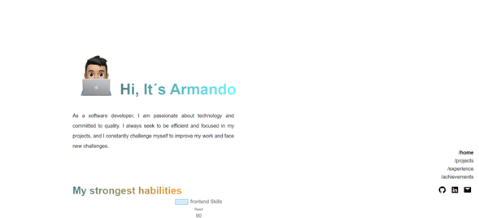
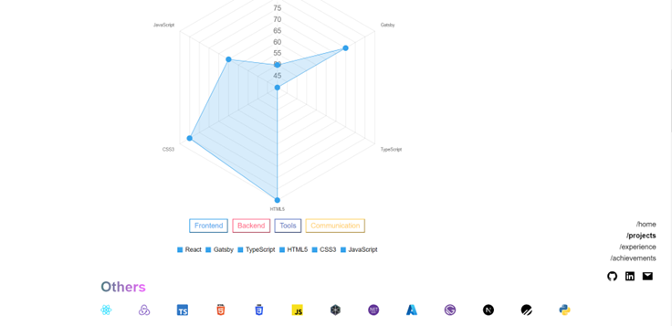
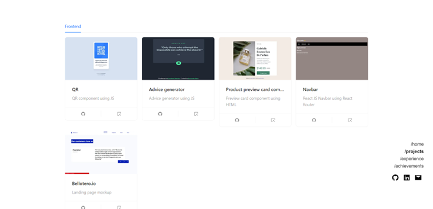
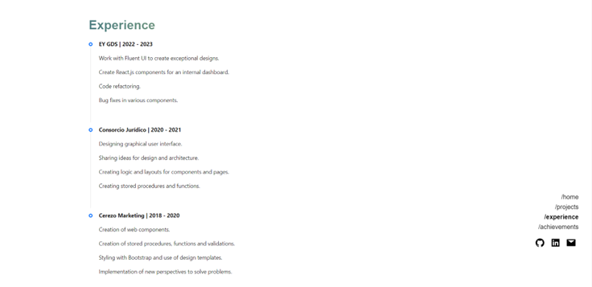
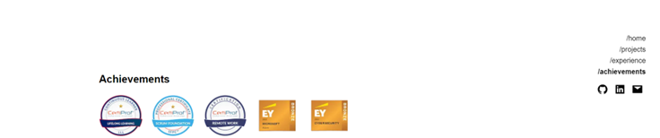
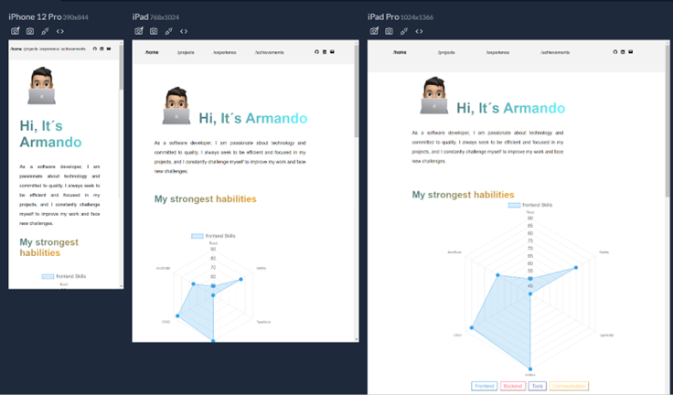

# My personal portfolio

This is my personal portfolio that I built to showcase my projects and experience throughout my development journey.

## Table of contents

- [Overview](#overview)
  - [The challenge](#the-challenge)
  - [Screenshot](#screenshot)
  - [Links](#links)
- [My process](#my-process)
  - [Built with](#built-with)
- [Author](#author)

## Overview

Personal portfolio

### The challenge

Users should be able to:

- View the optimal layout depending on their device's screen size
- View a functional radar chart

### Screenshot
## Home
**Home section**

## Skills
**Skills section**

## Projects
**Projects section**

## Experience
**Experience section**

## Achievements
**Achievements section**

## Responsive
**Responsive view**

### Links

- Live Site URL: [Portfolio](https://portfolio-armandonery.vercel.app/)

## My process

1. Design the layout
2. Create the folder structure
3. Create the components
4. Style the components

### Built with

- [Next.js](https://nextjs.org/) - React framework
- [Framer Motion](https://www.framer.com/motion/) - React library
- [Ant Design](https://ant.design/) - React UI library 
- [Chart.js](https://www.chartjs.org/) - JavaScipt charting library
- [Ainmate.css](https://animate.style/) - CSS animation library
- [TypeScript](https://www.typescriptlang.org/) - JavaScript with syntax for types.
- [React scroll](https://www.npmjs.com/package/react-scroll) - React.js pacakage
- [React icons](https://react-icons.github.io/react-icons/) - Icons for React
- HTML5
- Sass
- CSS Modules
- Flexbox
- CSS Grid

## Author

- Website - [Armando Nery](https://portfolio-armandonery.vercel.app/)